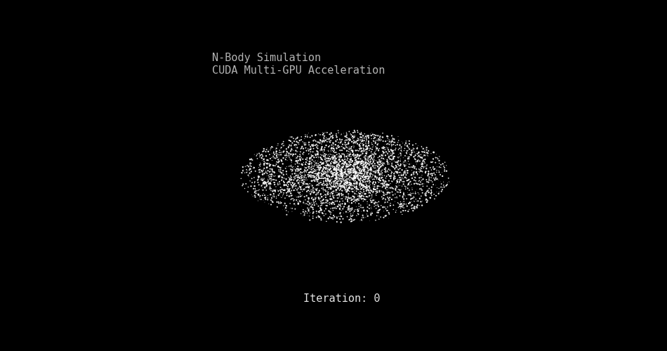

# nbody-openmp-cuda

**N-body gravitational simulation optimized for multi-GPU architectures.**

<p align="center">
  
</p>

Developed as part of the ECE415: High Performance Computing Systems course, this project started as a sequential reference implementation and was iteratively optimized using OpenMP for the CPU and CUDA for the GPU. The focus is on profiling driven optimization, memory efficiency and maximizing end toend throughput.

> **Status:** Completed. Achieved a **56.25× speedup** over the OpenMP baseline using multi-GPU execution and memory layout optimizations.

---

## What It Does

This simulation calculates the gravitational forces and updates the positions/velocities of bodies across multiple independent systems (galaxies). By isolating systems the workload avoids heavy synchronization allowing for massive parallelization across CPU threads and GPU blocks.

See `docs/report.pdf` for the complete methodology, optimization breakdown and performance plots.

---

##  Project Structure

```text
nbody-openmp-cuda/
├── src/
│   ├── Makefile            # Build configuration
│   ├── nbody.cu            # Main CUDA implementation
│   └── ...                 # Additional source files
├── docs/
│   ├── assets/             # Images and GIFs for README
│   └── report.pdf          # Detailed methodology and profiling plots
└── README.md
```


##  Design & Optimization Overview

The simulation started with a CPU OpenMP Baseline (achieving 7.51 GInter/s) and was optimized through 9 iterative GPU stages to extract maximum hardware performance:

1. **GPU Offload & Split Data Layout:** Transitioned from an Array of Structures (AoS) to a Split Structure of Arrays (Positions + Velocities) to enable coalesced memory access on the GPU.
2. **Shared Memory Tiling:** 512 element tiling strategy to stage coordinate subsets into fast shared memory, reducing global memory traffic in the `O(N²)` force loop.
3. **Loop Unrolling:** Applied `#pragma unroll 8` to the inner interaction loop to maximize instruction level parallelism (ILP) and reduce loop overhead.
4. **CUDA Streams:** Mapped independent galaxies to a pool of 16 CUDA streams to allow the GPU to process multiple systems concurrently.
5. **Fast Math & Read-Only Cache:** Used `__ldg()` to route coordinates through the read only data cache. Replaced expensive division and square root operations with hardware accelerated `rsqrtf()` and Fused Multiply Add (`fmaf`).
6. **Asynchronous Overlap:** Utilized pinned host memory (`cudaHostAlloc`) and `cudaMemcpyAsync` to enqueue data early achieving a 3-way overlap that completely hides Host-to-Device and Device-to-Host transfer latencies behind kernel execution.
7. **Advanced Stream Scheduling:** Shifted the host-side enqueueing logic into three distinct phases (All H2D → All Compute → All D2H) to ensure transfer overhead is entirely hidden even for the earliest galaxies.
8. **Multi-GPU Scaling:** Partitioned the workload across 2×GPUs(Tesla K80), managing per-device state, buffers and streams to double the compute bandwidth.
9. **Full SoA Redesign:** Refactored the data layout into a complete Structure of Arrays (`x[]/y[]/z[]/vx[]/vy[]/vz[]`). The data is perfectly aligned with contiguous warp memory accesses. Also, partitioned the workload across 4xGPUs(Tesla K80).


**Final Throughput: 423.33 GInter/s - Top of the class**


| Implementation | Execution Time | Throughput | Speedup |
| :--- | :--- | :--- | :--- |
| **CPU OpenMP Baseline** | 5.7137 s | 7.5175 GInter/s | 1.00× |
| **Final (4×GPU + SoA)** | 0.1016 s | 423.3374 GInter/s | **56.25×** |

### Test Environment
* **CPU:** 2× Intel Xeon E5-2695 v3 @ 2.30GHz
* **RAM:** 128 GiB
* **GPU:** 2× NVIDIA Tesla K80 (Provides 4× logical GK210GL GPUs)
* **Server:** `csl-venus`

---

##  Getting Started

### Requirements
* CUDA Toolkit (`nvcc`)
* A host C/C++ compiler supported by your CUDA toolkit (OpenMP enabled via `-Xcompiler -fopenmp`)

### Build
```bash
make -C src
```

### Run
```Bash
    ./src/nbody
```
### Clean
```Bash
    make -C src clean
```

